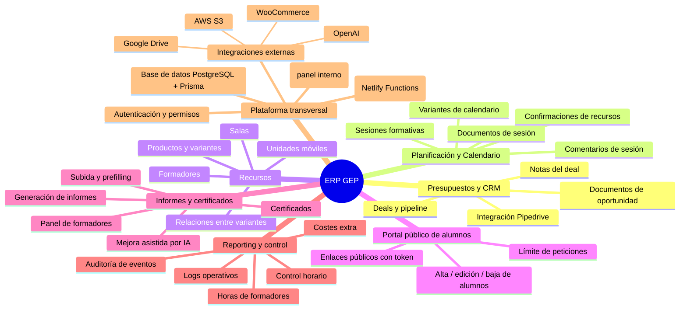
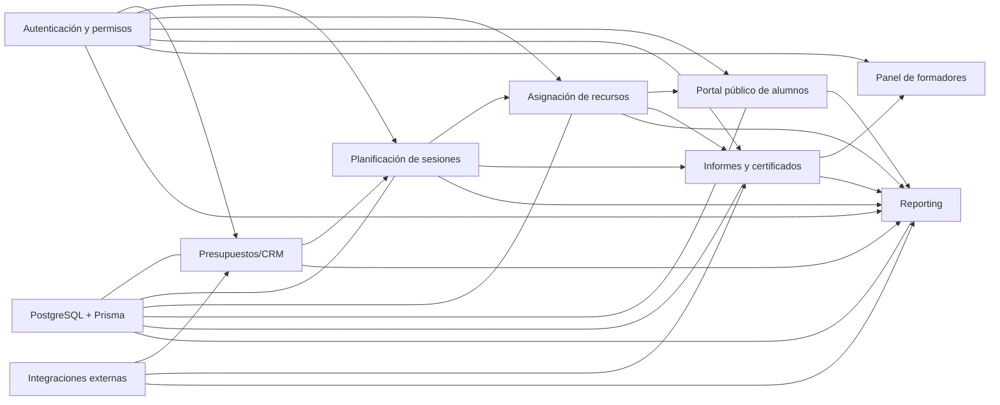

# Mapa visual de funcionalidades — ERP GEP

Este documento está pensado para usarlo como base de una **memoria funcional**. Incluye una vista global y una vista de relaciones entre módulos.

## 1) Mapa global (mindmap)

## 2) Mapa de relaciones entre módulos (flujo operativo)

## 3) Leyenda breve para la memoria

- **Origen del trabajo**: normalmente inicia en **Presupuestos/CRM** (oportunidad comercial).
- **Ejecución operativa**: pasa por **Planificación** + **Recursos**.
- **Interacción externa**: el alumno participa vía **Portal público**.
- **Salida documental**: se genera en **Informes y certificados**.
- **Trazabilidad y control**: todo converge en **Reporting** y eventos de auditoría.

## 4) Guion sugerido para redactar la memoria

1. **Contexto y objetivo del ERP**.
2. **Descripción de módulos** (usar el mindmap como índice).
3. **Flujo end-to-end** de una acción real (de presupuesto a informe).
4. **Gobierno del dato** (auth, roles, permisos y base de datos).
5. **Integraciones externas y valor aportado**.
6. **KPIs y reporting para la toma de decisiones**.

---

Este mapa sirve como soporte visual de la memoria completa disponible en `docs/memoria-funcional-erp-gep.md`.
