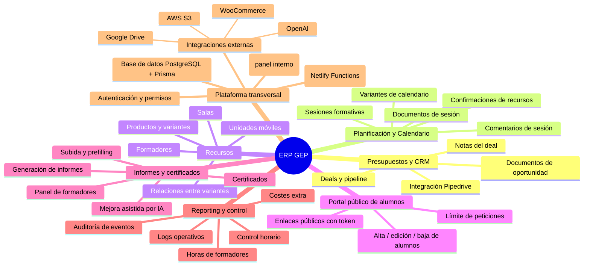
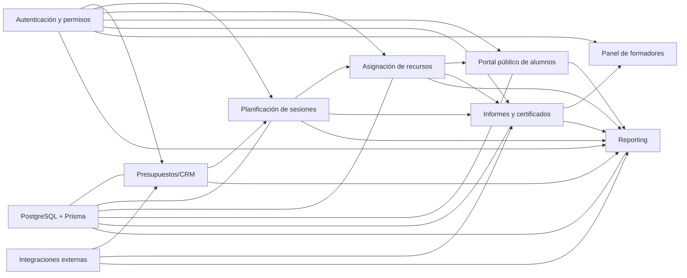

# Memoria funcional — ERP GEP

## 1. Introducción

El ERP GEP es una plataforma interna orientada a centralizar la operación diaria de formación, desde la gestión comercial inicial hasta la ejecución de sesiones, la documentación resultante y el control operativo posterior.

Su valor principal es integrar en un único sistema procesos que antes suelen estar dispersos en hojas de cálculo, correos o herramientas inconexas: presupuestos, planificación, recursos, portal público de alumnos, informes, certificación y reporting.

A nivel técnico, el sistema se apoya en un frontend React para operación interna, una API serverless en Netlify Functions para la lógica de negocio y una base de datos PostgreSQL gestionada con Prisma como modelo único de datos.

## 2. Objetivos

### 2.1 Objetivo general

Disponer de un entorno ERP único y trazable para la gestión integral del ciclo de vida de acciones formativas.

### 2.2 Objetivos específicos

1. Centralizar la gestión de oportunidades, sesiones y recursos.
2. Reducir fricción operativa en la coordinación entre equipos.
3. Garantizar trazabilidad documental y de eventos.
4. Habilitar interacción segura con alumnado mediante portal público con token.
5. Facilitar la toma de decisiones con reporting operativo y de control.
6. Mantener una arquitectura extensible para nuevas integraciones y módulos.

## 3. Alcance

### 3.1 Alcance funcional incluido

- **Presupuestos y CRM**: deals, notas y documentos comerciales.
- **Planificación y calendario**: sesiones, variantes, comentarios y documentación operativa.
- **Recursos**: gestión de formadores, salas, unidades móviles y variantes de producto.
- **Portal público de alumnos**: alta/edición/baja de alumnos con enlaces públicos seguros.
- **Informes y certificados**: generación, mejora, carga y soporte documental para formación.
- **Reporting y control**: auditoría, logs, horas de formadores, control horario y costes extra.
- **Seguridad y gobierno de acceso**: autenticación y permisos por rutas/capacidades.

### 3.2 Alcance técnico incluido

- Monorepo TypeScript con frontend y backend desacoplados.
- Persistencia en PostgreSQL modelada con Prisma.
- Integraciones con Pipedrive, AWS S3, Google Drive, OpenAI y WooCommerce.

### 3.3 Fuera de alcance de esta memoria

- Manual de usuario detallado por pantalla.
- Diseño UX/UI de bajo nivel.
- Plan de migración de datos históricos desde sistemas legacy.

## 4. Metodología

### 4.1 Enfoque de análisis funcional

La memoria se estructura por módulos de negocio y por flujo end-to-end. Se describe primero el mapa de capacidades y, después, cómo circula el trabajo entre áreas hasta llegar a reporting.

### 4.2 Flujo operativo de referencia

1. Se inicia una oportunidad en **Presupuestos/CRM**.
2. La oportunidad se transforma en necesidad de ejecución en **Planificación**.
3. Se concretan medios humanos y materiales en **Recursos**.
4. Se habilita la participación de alumnado mediante **Portal público**.
5. Se generan salidas en **Informes y certificados**.
6. Se consolida trazabilidad y seguimiento en **Reporting y control**.

### 4.3 Criterios de calidad funcional

- Coherencia del dato entre módulos.
- Trazabilidad de cambios y eventos.
- Seguridad de acceso (autenticación y permisos).
- Reproducibilidad documental (informes/certificados).
- Capacidad de auditoría y análisis operativo.

## 5. Conclusiones

1. El ERP GEP cubre de forma integral la cadena operativa de formación, desde la fase comercial hasta el control posterior.
2. La segmentación modular permite escalar por dominios sin perder consistencia de datos.
3. El portal público y la capa documental mejoran la relación con alumnado y formadores, reduciendo carga administrativa interna.
4. El reporting unificado aporta visibilidad para decisiones de planificación, calidad y costes.
5. La arquitectura técnica actual es adecuada para evolución incremental del producto.

## 6. Anexos

### Anexo A — Mapa global de funcionalidades (Mermaid)

### Anexo B — Mapa de relaciones operativas (Mermaid)

### Anexo C — Fuente y trazabilidad documental

- Resumen funcional del repositorio en `README.md`.
- Mapa visual base en `docs/mapa-funcionalidades-erp.md`.

